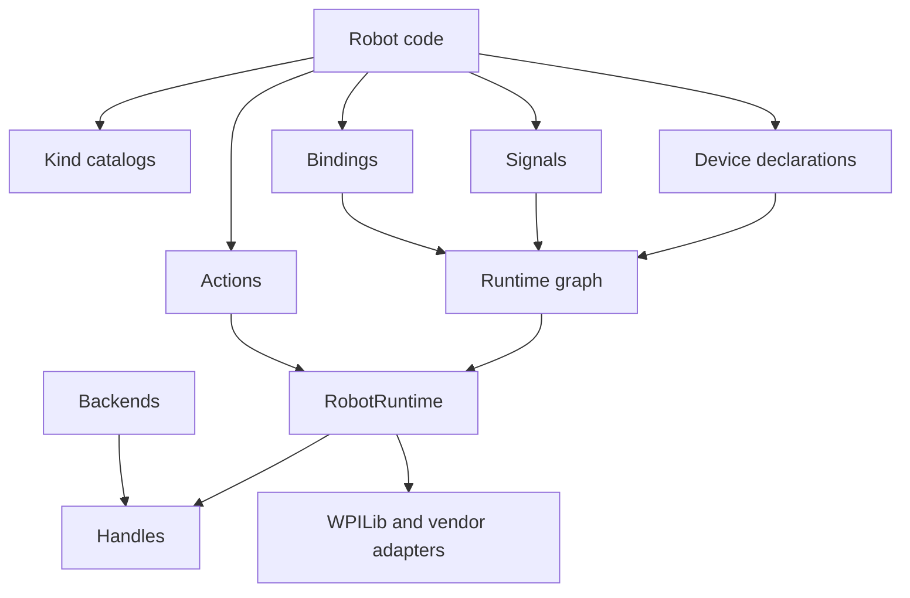

# Athena 2027 API Landscape

This document is the pruning map for the 2027 API. Rebuilt 2027 is the main usage proof, not the only feature whitelist. API is removed when it is an old concept, duplicate wiring, unreleased V3 cleanup, and unsupported by the new architecture. Adjacent feature implementations stay when they fit the final API with the same shape as a used feature.

Status words:

- `KEEP`: keep as public API with the listed final name.
- `RENAME`: keep as public API, but rename to the listed final name.
- `KEEP INTERNAL`: keep only the implementation needed by a kept API. This is not a hiding place for old public API.
- `REMOVE`: delete from public API because the concept is old, duplicated, and unsupported by the final architecture.
- `ADD`: missing public API needed by the 2027 architecture.
- `IMPLEMENT`: feature should exist, but must be rebuilt behind the final API instead of preserving old wiring.

## Definitive Naming Rules

| Name | Meaning |
| --- | --- |
| `Kind` | One option from a category list. |
| `Device` | Robot-facing hardware declaration. |
| `Handle` | Runtime-bound live hardware object. |
| `Signal` | Typed readable stream that emits one kind of value. |
| `Binding` | Relationship between declarations, triggers, controls, hooks, and followers. |
| `Action` | Behavior request passed to a runtime. |
| `Config` | Removed V3 builder shape. |
| `Graph` | Internal lowered robot structure built from declarations. |
| `Runtime` | Executor that owns mutation, scheduling, simulation, and estimation. |
| `Context` | Runtime read/write surface passed to behavior code. |
| `Backend` | Vendor and sim factory that creates handles. |
| `Adapter` | Bridge to WPILib and vendor frameworks. |
| `Source` | External input boundary. |
| `Sink` | External output boundary. |
| `Catalog` | Static user entry point that creates declarations and Actions. |

## Rebuilt 2027 Used Public Surface

This is the current public API Rebuilt actually imports.

- Hardware kinds: `MotorKinds`, `EncoderKinds`, `ImuKinds`, `CameraKinds`.
- Hardware declarations: `MotorDevice`, `EncoderDevice`, `ImuDevice`, `DigitalInputDevice`, `HardwareBus`.
- Hardware values: `GearRatio`, `Range`, `EncoderUnit`.
- Simulation declarations: composable `SimModel` and `SimulationSession`.
- Mechanisms: `Mechanism`, `Action`, `Actions`, `Events`, `HookBinding`, `EventContext`, `LifecycleMode`, `LifecyclePhase`, `RobotRuntime`, `PathAction`, `Paths`.
- Control values: `ControlBinding`, `PidGains`, `FeedforwardGains`, `Constraint`, `MotionProfile`, `MotionPlanner`, `InterpolationModel`, `InterpolationKinds`.
- Runtime helpers: `ModifiedAxis`, `RobotVelocity`, `PoseSnapshot`, `Measurement`, `Measurements`, `MeasurementStdDevs`.
- Localization: `PoseSignal`, `Localization`, `Localizations`, shared `Geometry2d` shapes, and `LocalizationFilters`.
- Vision: `Cameras`, `HeliosDevice`, `LimelightDevice`, `PhotonVisionDevice`, `CameraMountPose`.
- Commands: `CommandAction`.
- Drivetrain geometry: `WheelBase`, `TrackWidth`.

Everything else is required implementation behind these APIs. Old public surface is deleted.

## Final Public Shape



## Kinds

`Kind` stays public. `Athena*` catalog names do not.

| Current API | Final API | Status | Reason |
| --- | --- | --- | --- |
| `HardwareKind` | `HardwareKind` | KEEP | Shared key contract for hardware categories. |
| `MotorKind` | `MotorKind` | KEEP | Used through motor declarations and vendor backends. |
| `EncoderKind` | `EncoderKind` | KEEP | Used through encoder declarations and swerve. |
| `ImuKind` | `ImuKind` | KEEP | Used by drivetrain and localization. |
| `CameraKind` | `CameraKind` | KEEP | Used by camera declarations. |
| `AthenaMotor` | `MotorKinds` | RENAME | Built-in motor kind catalog. |
| `AthenaEncoder` | `EncoderKinds` | RENAME | Built-in encoder kind catalog. |
| `AthenaImu` | `ImuKinds` | RENAME | Built-in IMU kind catalog. |
| `AthenaCamera` | `CameraKinds` | RENAME | Built-in camera kind catalog. |
| `EncoderUnit` | `EncoderUnit` | KEEP | Rebuilt uses it for swerve angle units. |
| `InputSourceKind` | removed | REMOVE | Old config/spec lowering detail. |
| `InputType` | removed | REMOVE | Old config/spec lowering detail. |
| `EncoderSignalType` | removed | REMOVE | Old config/spec lowering detail. |
| `NeutralMode` | `MotorNeutralMode` | RENAME | Hardware behavior option belongs with motor declarations. |
| `MotorCapability` | removed | REMOVE | Old public backend-validation shape. |
| `SensorKind` | removed | REMOVE | Rebuilt uses direct devices and signals, not sensor configs. |
| `BlockDirection` | removed | REMOVE | Old sensor-config API. |
| `AxisKind` | removed | REMOVE | Axis API is not used by Rebuilt. |
| `ControlMode` in `mechanism.core` | removed | REMOVE | Old public control-mode surface. |
| `ControlMode` in `mechanism.spec` | removed | REMOVE | Duplicate old spec surface. |
| `BlockPolicy` | removed | REMOVE | Rule API is removed. |
| `Direction` | removed | REMOVE | Old output resolver public surface. |
| `EventActivation` | removed | REMOVE | Replace with `Events` and `HookBinding` factories. |
| `HookTrigger` | removed | REMOVE | Replace with `Events` and `HookBinding` factories. |
| `LifecycleMode` | `LifecycleMode` | KEEP | Rebuilt robot runtime uses it. |
| `LifecyclePhase` | `LifecyclePhase` | KEEP | Rebuilt robot runtime uses it. |
| `RobotMode` | removed | REMOVE | `LifecycleMode` is the final lifecycle enum. |
| `TelemetryType` | removed | REMOVE | Public telemetry API is not used by Rebuilt. |
| `DiagnosticLevel` | removed | REMOVE | No public diagnostics API yet. |

## Devices And Handles

`Device` is the robot-facing declaration. `Handle` is the live runtime object. This resolves the current name collision.

| Current API | Final API | Status | Reason |
| --- | --- | --- | --- |
| `MotorRef` | `MotorDevice` | RENAME | Rebuilt declares motors everywhere. |
| `EncoderRef` | `EncoderDevice` | RENAME | Rebuilt declares encoders for mechanisms and swerve. |
| `ImuRef` | `ImuDevice` | RENAME | Rebuilt declares drivetrain IMU. |
| `DigitalInputRef` | `DigitalInputDevice` | RENAME | Rebuilt uses limit switches. |
| `DigitalInputs` | `DigitalInputs` | KEEP | Catalog for digital input devices. |
| `AnalogInputRef` | removed | REMOVE | Not used by Rebuilt. |
| `AnalogInputs` | removed | REMOVE | Not used by Rebuilt. |
| `ControllerRef` | removed | REMOVE | Rebuilt uses a local controls wrapper, not Athena controller refs. |
| `Controllers` | removed | REMOVE | Not used by Rebuilt. |
| `ButtonRef` | removed | REMOVE | Not used by Rebuilt. |
| `ControllerAxisRef` | removed | REMOVE | Not used by Rebuilt. |
| `CameraRef` | `CameraDevice` | RENAME | Base public camera declaration. |
| `LimelightRef` | `LimelightDevice` | RENAME | Rebuilt uses Limelight camera declarations. |
| `HeliOSRef` | `HeliosDevice` | RENAME | Rebuilt uses HeliOS camera declarations. |
| `PhotonRef` | `PhotonVisionDevice` | RENAME | Adjacent camera backend using the same camera-device API. |
| `GenericCameraRef` | removed | REMOVE | Generic placeholder is not a concrete device family. |
| `MotorId` | removed | REMOVE | Fold fields into `MotorDevice`. |
| `EncoderId` | removed | REMOVE | Fold fields into `EncoderDevice`. |
| `CameraId` | removed | REMOVE | Fold fields into `CameraDevice`. |
| `HardwareBus` | `HardwareBus` | KEEP | Rebuilt uses named CAN bus constants. |
| backend `MotorDevice` | `MotorHandle` | RENAME | Live object returned by a backend. |
| backend `EncoderDevice` | `EncoderHandle` | RENAME | Live object returned by a backend. |
| backend `ImuDevice` | `ImuHandle` | RENAME | Live object returned by a backend. |
| `SimMotorDevice` | `SimMotorHandle` | RENAME | Sim live handle. |
| `SimImuDevice` | `SimImuHandle` | RENAME | Sim live handle. |
| `CtreMotorDevice` | `CtreMotorHandle` | RENAME | CTRE live handle. |
| `CtreEncoderDevice` | `CtreEncoderHandle` | RENAME | CTRE live handle. |
| `CtrePigeon2Device` | `CtrePigeon2Handle` | RENAME | CTRE live handle. |
| `RevMotorDevice` | `RevMotorHandle` | RENAME | REV live handle. |
| `RevThroughBoreEncoderDevice` | `RevThroughBoreEncoderHandle` | RENAME | REV live handle. |
| `StudicaImuDevice` | `StudicaImuHandle` | RENAME | Studica live handle. |

## Signals

Signals are typed streams. The final name must say what value comes out of the stream. `Signal` is not a generic replacement for old `Ref` names.

### Direct device reads

Robot code reads runtime-owned sensor snapshots directly from declarations. Reading a value must not require an
`ActionContext`, hook context, mechanism context, or runtime object:

```java
double armPosition = armEncoder.position();
double armVelocity = armEncoder.velocity();
double moduleAngle = moduleEncoder.absolutePosition();
double heading = imu.yawDegrees();
boolean atHome = homeSwitch.active();
Optional<PoseSnapshot> cameraPose = camera.pose().value();
Optional<TargetMeasurementSample> target = camera.targets().latest();
```

The runtime discovers declarations, creates their vendor handles, refreshes each handle once per input cycle, and
binds the declaration to that cached handle. Every read in the cycle observes the same snapshot; getters do not poll
vendor APIs again. A declaration read before registration, or after its runtime closes, fails with a clear
`IllegalStateException`. Multiple simultaneous runtimes are isolated by runtime scope so tests and simulation cannot
silently read another runtime's device.

`PositionSignal` and `VelocitySignal` use context-free `position()` and `velocity()` methods, so custom feedback,
constraints, hooks, and ordinary helper methods all use the same API. `EncoderDevice.absolutePosition()` is the
numeric absolute channel; `absoluteSignal()` adapts that channel when a control binding needs a `PositionSignal`.
Camera pose and target signals expose typed optional reads because no measurement is a valid state. Legacy
`PoseSignal.pose()` remains an origin-fallback convenience, not the authoritative missing-data API.

`ActionContext` remains runtime-internal for applying outputs and executing device mutations. It is not part of the
robot-facing read path.

Final signal names:

- `BooleanSignal`: emits a boolean.
- `NumberSignal`: emits a double.
- `PoseSignal`: emits pose measurements.
- `TargetSignal`: emits vision targets.
- `MeasurementSignal`: emits mixed measurement types and is only for generic measurement composition.

Localization is not a signal. It is a pipeline that consumes pose/measurement signals and produces a pose estimate.

| Current API | Final API | Status | Reason |
| --- | --- | --- | --- |
| `MeasurementRef` | `MeasurementSignal` | RENAME | Rebuilt uses generic measurement composition. |
| `Measurements` | `Measurements` | KEEP | Catalog for typed measurement signals and values. |
| `MeasurementStdDevs` | `MeasurementStdDevs` | KEEP | Rebuilt uses vision weighting. |
| `CameraPoseRef` | `PoseSignal` | RENAME | Camera pose streams emit pose measurements. |
| `CameraTargetRef` | `TargetSignal` | RENAME | Target streams are a valid camera signal family. |
| `LocalizationRef` | `Localization` | RENAME | Rebuilt composes pose signals through uniform localization nodes. |
| `LocalizationEstimatorRef` | removed | REMOVE | Estimation is a `Localization` node, not a separate public abstraction. |
| `LocalizationFilterRef` | `LocalizationFilter` | RENAME | Rebuilt uses filters publicly. |
| `BooleanRef` | `BooleanSignal` | REMOVE | Name is valid, but Rebuilt uses direct digital input devices now. |
| `Booleans` | removed | REMOVE | Not used by Rebuilt. |
| `NumberRef` | `NumberSignal` | REMOVE | Name is valid, but Rebuilt does not use number streams now. |
| `Numbers` | removed | REMOVE | Not used by Rebuilt. |
| `RuntimeBoolean` | removed | REMOVE | Old runtime-ref surface. |
| `RuntimeNumber` | removed | REMOVE | Old runtime-ref surface. |
| `RuntimeEncoder` | removed | REMOVE | Old runtime-ref surface. |
| `RuntimeMotor` | removed | REMOVE | Old runtime-ref surface. |

## Values

Plain values stay public only when robot code uses them. Declaration-critical values stay with the declaration that owns them.

| Current API | Final API | Status | Reason |
| --- | --- | --- | --- |
| `RangeRef` | `Range` | RENAME | Rebuilt uses mechanism travel ranges. |
| `GearRatioRef` | `GearRatio` | RENAME | Rebuilt uses gearing for encoders and sim. |
| `PidRef` | `PidGains` | RENAME | Rebuilt uses PID constants. |
| `FeedforwardRef` | `FeedforwardGains` | RENAME | Rebuilt uses feedforward constants. |
| `CrtRef` | removed | REMOVE | Not used by Rebuilt. |
| `WheelBase` | `WheelBase` | KEEP | Rebuilt drivetrain uses it. |
| `TrackWidth` | `TrackWidth` | KEEP | Rebuilt drivetrain uses it. |
| Old module location ref | removed | REMOVE | Old graph/introspection helper; Rebuilt-style swerve uses mechanism-owned geometry. |
| `CameraMountPose` | `CameraMountPose` | KEEP | Rebuilt uses camera placement. |
| `ImuMountPose` | removed | REMOVE | Not used by Rebuilt. |
| `PoseSnapshot` | `PoseSnapshot` | KEEP | Rebuilt localization uses it. |
| `RobotVelocity` | `RobotVelocity` | KEEP | Rebuilt localization uses it. |
| `RobotSpeeds` | removed | REMOVE | Rebuilt uses WPILib `ChassisSpeeds`; public Athena drive runtime will define its own Action. |
| `MotionLimits` | removed | REMOVE | Not used by Rebuilt. |
| `FilteredPose` | removed | REMOVE | Not used by Rebuilt. |
| `FilteredValue` | removed | REMOVE | Not used by Rebuilt. |
| measurement records | removed | REMOVE | `Measurements` should expose factories, not public record classes. |
| `VisionObservation` | removed | REMOVE | Not used directly by Rebuilt. |
| `VisionFrame` | removed | REMOVE | Not used directly by Rebuilt. |
| `CameraTargetView` | removed | REMOVE | Old target view DTO; target streams use `TargetSignal`. |
| `VisionPoseEstimate` | removed | REMOVE | Old public estimator output shape. |
| `LocalizationResult` | removed | REMOVE | Old public pipeline output shape. |
| telemetry/dashboard packet values | removed | REMOVE | Rebuilt has no public dashboard/telemetry API usage. |
| diagnostics values | removed | REMOVE | No public diagnostics API yet. |
| plugin feature values | removed | REMOVE | Old public plugin feature surface. |

## Bindings

Bindings connect robot declarations to runtime behavior.

| Current API | Final API | Status | Reason |
| --- | --- | --- | --- |
| `HookRef` | `HookBinding` | RENAME | Rebuilt uses hooks for lifecycle and limit switches. |
| `Events` | `Events` | KEEP | Rebuilt uses event catalog. |
| `HookRunner` | removed | REMOVE | Final robot code should use `RobotRuntime`; do not preserve the prototype runner API. |
| `EventContext` | `EventContext` | KEEP | Hook callbacks need context. |
| `PathRef` | `PathAction` | RENAME | Rebuilt uses paths as mechanism Actions. |
| `Paths` | `Paths` | KEEP | Rebuilt uses path Action catalog. |
| missing path provider binding | `PathProvider` | ADD | Common provider interface for PathPlanner, Choreo, and inline/test paths. |
| missing path marker binding | `PathMarkerBinding` | ADD | Marker-to-Action/action binding for path following. |
| `ActionRef` | `ActionBinding` | RENAME | Used by `Actions.doOnce` and `Actions.run`; keep if those Actions stay. |
| `MotorFollowerRef` | `MotorFollowerBinding` | RENAME | Follower behavior is a hardware relationship. |
| `ControlRef` | `ControlBinding` | RENAME | Needed for drivetrain composite controls. |
| `Control` | `Controls` | RENAME | Public catalog for `ControlBinding`. |
| `ControlLoopRef` | `ControlLoop` | RENAME | Public control-loop declaration. |
| `ControlLoopBinding` | `ControlLoopBinding` | KEEP | Correct name. |
| `ConstraintRef` | removed | REMOVE | Not used by Rebuilt. |
| `RuleRef` | removed | REMOVE | Not used by Rebuilt. |
| `Rules` | removed | REMOVE | Not used by Rebuilt. |
| `OutputTarget` | removed | REMOVE | Old resolver public surface. |
| `SwerveModuleOrder` | removed | REMOVE | Runtime graph construction should not depend on public annotation API. |
| `InitialState` | removed | REMOVE | Rebuilt declares Actions directly. |

## Actions

Actions are the main public behavior API and stay public.

Robot-facing code should request an Action directly with `action.request()` or through the one-argument robot helper. The runtime infers ownership from registered mechanism Action fields.

Control Actions execute through the same output path as motor Actions. `ControlBinding` loop runtimes reset on first use and when the requested output kind changes; same-mode dynamic targets preserve controller and profile state. Target transforms run before constraints and planning, profiles produce position/velocity/acceleration references, PID and feedforward consume those references, and final output saturation plus directional and predictive constraint checks run last.

Athena's built-in PID and feedforward gains always produce volts. Their contributions add directly and the final closed-loop request is clamped to the available 12V command range. Percent remains an explicit open-loop motor Action or custom `ControlOutput.percent(...)`; it is never the implicit unit of `.pid(...)`. A vendor backend may run a loop on-device only when that controller exposes voltage-output PID semantics in Athena's position and velocity units. Otherwise Athena runs the same voltage loop and calls `setVoltage(...)`.

`PidGains` contains `kP`, `kI`, `kD`, and `iZone`; tolerance belongs to Action completion and reusable
`ControlBinding.at(...)` conditions, not controller gains. Integral state uses composed-output anti-windup and resets
when the control is neutralized. Derivative is taken from measurement to avoid target-step kick. `FeedforwardGains`
contains `kS`, `kV`, `kA`, and constant `kG`. Device offload is allowed only when every targeted motor supports the
same voltage-semantic request and the selected feedback source is actually configured by the backend.

Position and velocity bindings can create a data-driven target with
`control.interpolate(InterpolationKinds.LINEAR, input).at(point, value)`. Points are sorted, endpoint values are
clamped, and the input plus dynamic points and values are sampled once per control evaluation. `InterpolationModel`
is the custom-model boundary; it receives the sampled input and ordered `InterpolationData`, so a mechanism can use
regression or another team model without introducing a separate scheduler or output path.

| Current API | Final API | Status | Reason |
| --- | --- | --- | --- |
| `MechanismState` | `Action` | RENAME | Public behavior request type. |
| `Actions` | `Actions` | KEEP | Rebuilt uses it heavily. |
| nested records in `Actions` | nested Action implementations | KEEP INTERNAL | Current factories return them directly; hide later only if a stable facade replaces every public return type. |
| nested records in `MotorRef` | removed | REMOVE | Device declarations must not own Action classes. |
| `AxisState` | removed | REMOVE | Rebuilt does not use public axis API. |
| `AxisStateSource` | removed | REMOVE | Rebuilt does not use public axis API. |
| `MechanismStateSpec` | removed | REMOVE | Old spec path, not used by Rebuilt. |
| `SuperstructureStateSpec` | removed | REMOVE | Superstructure API is not used by Rebuilt. |
| `SimMotorState` | removed | REMOVE | Sim behavior is backend/session state, not public Actions. |
| `SimImuState` | removed | REMOVE | Sim behavior is backend/session state, not public Actions. |
| `SuperstructureTransitionPlan` | removed | REMOVE | Superstructure API is not used by Rebuilt. |
| `SuperstructureMechanismTarget` | removed | REMOVE | Superstructure API is not used by Rebuilt. |

## Mechanism Templates And Slots

`MechanismTemplate` is the supported replacement concept for reusable mechanism blueprints. It is not a swerve-only API and it is not a revived `Spec` layer. A template is still a `Mechanism`; it can expose typed `Slot` fields for required devices or values that robot code must fill before runtime use.

Slots live in `athena-mechanisms` because they describe mechanism composition, not physical hardware ownership. Hardware devices are one common slot value, but the boundary is generic: the template declares what it needs, robot code fills those slots, then normal mechanism introspection sees the filled declarations and controls.

| Current API | Final API | Status | Reason |
| --- | --- | --- | --- |
| missing template marker | `MechanismTemplate` | ADDED | Marks reusable mechanism blueprints without bringing back public specs. |
| missing fillable requirement API | `Slot`, `Slots`, typed slot classes | ADDED | Lets any mechanism template expose required fill-ins. |
| `SwerveModuleSpec` preset path | `SwerveModules.*` template classes | REPLACE | Swerve presets are one consumer of the generic mechanism-template pattern. |

## Removed DTO And Builder Layer

The old DTO/builder layer is not a 2027 API category. Rebuilt uses declarations and Actions, not config builders.

`Spec` does not survive as an Athena 2027 architecture layer. Current `*Spec` types do mechanical work in the old code: they hold normalized data, run validation, and feed a few backends, WPILib adapters, and sim helpers. That behavior moves into `Device`, `RobotGraph`, `RobotRuntime`, backend handles, and focused value types. Public `*Spec` records are deleted.

| Current API | Final API | Status | Reason |
| --- | --- | --- | --- |
| `MotorSpec` | removed | REMOVE | Replace with `MotorDevice` fields and runtime lowering. |
| `EncoderSpec` | removed | REMOVE | Replace with `EncoderDevice` fields and runtime lowering. |
| `ImuSpec` | removed | REMOVE | Replace with `ImuDevice` fields and runtime lowering. |
| `CameraSpec` | removed | REMOVE | Replace with `CameraDevice` fields and runtime lowering. |
| `LocalizationSpec` | removed | REMOVE | Replace with `Localization` composition. |
| `SwerveModuleSpec` | removed | REMOVE | Replace with swerve graph/runtime. |
| `SwerveDrivetrainSpec` | removed | REMOVE | Replace with swerve graph/runtime. |
| `DifferentialDrivetrainSpec` | removed | REMOVE | Rebuilt is swerve-only. |
| `CommandSpec` | `CommandAction` | RENAME | Rebuilt experimental controls import it as command behavior descriptor. |
| `AutoChooserSpec` | removed | REMOVE | Old chooser DTO. |
| `AutoRoutineSpec` | removed | REMOVE | Old routine DTO; final autos use `AutoRoutine`/`AutoRuntime` around command/action behavior, not specs. |
| `RobotLifecycleSpec` | removed | REMOVE | `AthenaRobot` and `RobotRuntime` own lifecycle. |
| all `*Config` builders | removed | REMOVE | Old V3 builder public API, not used by Rebuilt. |
| `HeliOSConfig` | removed | REMOVE | Use `Cameras.helios` and `HeliosDevice` declarations. |

## Runtime Graph

`Definition` as a public-facing concept is out of date. The final system needs an internal runtime graph built from declarations, signals, bindings, Actions, controls, camera devices, path providers, and sim models. Robot code should not author `Definition` objects.

| Current API | Final API | Status | Reason |
| --- | --- | --- | --- |
| `MechanismDefinition` | `MechanismNode` | RENAME | Internal graph node behind `RobotRuntime`. |
| Old swerve drive/module definition API | removed | REMOVE | Swerve is mechanism composition, not an inspected graph. |
| missing root graph | removed | REMOVE | Root `RobotRuntime` owns cross-module composition directly; `RobotGraph` is mechanism-internal graph lowering. |
| missing hardware graph | `HardwareGraph` | ADD | Internal graph that binds device declarations to handles. |
| missing vision graph | `VisionGraph` | ADD | Internal graph for `CameraDevice` declarations and pose/target signals. |
| missing path graph | `PathGraph` | ADDED | Runtime marker graph for validated autonomous marker bindings. |

## Runtimes

Runtimes execute. Robot code should touch one public runtime host, not a collection of low-level runtime parts.

| Current API | Final API | Status | Reason |
| --- | --- | --- | --- |
| `MechanismRegistry` | `RobotRuntime` | RENAME | Rebuilt wraps it as `AthenaRobot`; make that library-owned. |
| `MechanismRuntime` | package-private `MechanismRuntime` | INTERNAL | Execution detail required by root `RobotRuntime`; not public API. |
| `MechanismController` | removed | REMOVE | Not used by Rebuilt. |
| `ControlLoopRuntime` | `ControlLoopRuntime` | KEEP INTERNAL | Execution detail required by `ControlLoop`. |
| missing worker policy | `RuntimeWorker`, `RuntimeWorkers` | ADD | Optional root-owned worker configuration for snapshot tasks; default runtime stays single-threaded. |
| `PathRuntime` | `PathRuntime` | KEEP INTERNAL | Execution detail required by `PathAction`. |
| `AthenaTimedRobot` | `AthenaRobot` | RENAME | WPILib runtime host should own lifecycle and `RobotRuntime`. |
| `CommandRunner` | removed | REMOVE | Old command execution surface. |
| `WpilibCommandScheduler` | removed | REMOVE | Rebuilt controls use WPILib commands directly. |
| `AutoExecution` | `AutoRuntime` | IMPLEMENT | Needed for selected autos, but old chooser/spec execution is removed. |
| `AutoRegistry` | removed | REMOVE | Old global registry. |
| `AutoInputStore` | removed | REMOVE | Old auto input store. |
| `AutoInputScope` | removed | REMOVE | Old auto input scope. |
| `VisionPoseEstimator` | removed | REMOVE | Vision sources produce `PoseSignal`; localization nodes own fusion. |
| `VisionTurnAssist` | removed | REMOVE | Not used by Rebuilt. |
| superstructure runtimes | removed | REMOVE | Rebuilt uses Action composition instead of superstructure module. |
| `SimWorld` | `SimulationSession` | RENAME | Public simulation coordinator for backend state, physics, pose, and test readback. |
| `SimMechanism` | removed | REMOVE | Replace with session-coordinated model execution through normal device handles. |
| `SimModelRunner` | `SimModelRunner` | KEEP INTERNAL | Internal model stepping behind `SimulationSession`. |
| Temporary swerve sim bridge | removed | REMOVE | Temporary bridge duplicated mechanism behavior and direct target mutation. |
| `SimDifferentialDrive` | removed | REMOVE | Rebuilt is swerve-only. |
| `SimVisionCamera` | removed | REMOVE | Rebuilt does not use vision simulation. |
| telemetry/dashboard runtimes | removed | REMOVE | Not used by Rebuilt. |
| diagnostics runtimes | removed | REMOVE | No public diagnostics API yet. |
| `ModifiedAxis` | `ModifiedAxis` | KEEP | Rebuilt controls use it. |
| `TimedRunner` | removed | REMOVE | Not used by Rebuilt. |
| `Debouncer` | removed | REMOVE | Not used by Rebuilt. |
| `DelayedOutput` | removed | REMOVE | Not used by Rebuilt. |
| `ManualClock` | removed | REMOVE | Test helpers should not be public API. |

## Contexts

Contexts are runtime plumbing. Only event context stays public.

| Current API | Final API | Status | Reason |
| --- | --- | --- | --- |
| `EventContext` | `EventContext` | KEEP | Rebuilt hook callbacks use it. |
| `ActionContext` | `ActionContext` | KEEP INTERNAL | Runtime hardware surface required by `RobotRuntime`. |
| `MappedActionContext` | `MappedActionContext` | KEEP INTERNAL | Runtime implementation required by tests and sim. |
| `MechanismContext` | `MechanismContext` | KEEP INTERNAL | Runtime tick facts used by Actions, scheduling, controls, and tests. |
| `ControlLoopContext` | `ControlLoopContext` | KEEP INTERNAL | Required by `ControlLoopRuntime`. |
| `RuleContext` | removed | REMOVE | Rules public API is removed. |
| `LocalizationFilterContext` | removed | REMOVE | Filters should receive typed pose/measurement data directly. |
| `LocalizationEstimateContext` | removed | REMOVE | `Localization` owns its evaluation state. |
| `AthenaValidationContext` | removed | REMOVE | Old validation context shape. |

## Backends

Backends stay implementation-facing. They should not shape robot code.

| Current API | Final API | Status | Reason |
| --- | --- | --- | --- |
| `BackendRegistry` | `BackendRegistry` | KEEP INTERNAL | Owned by `RobotRuntime`. |
| `MotorBackend` | `MotorBackend` | KEEP INTERNAL | Vendor adapter SPI required by motor handles. |
| `EncoderBackend` | `EncoderBackend` | KEEP INTERNAL | Vendor adapter SPI required by encoder handles. |
| `ImuBackend` | `ImuBackend` | KEEP INTERNAL | Vendor adapter SPI required by IMU handles. |
| `SimMotorBackend` | `SimMotorBackend` | KEEP INTERNAL | Sim adapter selected by `SimulationSession`/`HardwareGraph`. |
| `SimImuBackend` | `SimImuBackend` | KEEP INTERNAL | Sim adapter selected by `SimulationSession`/`HardwareGraph`. |
| `CtreMotorBackend` | `CtreMotorBackend` | KEEP INTERNAL | Vendor adapter required by CTRE motors. |
| `CtreEncoderBackend` | `CtreEncoderBackend` | KEEP INTERNAL | Vendor adapter required by CTRE encoders. |
| `CtreImuBackend` | `CtreImuBackend` | KEEP INTERNAL | Vendor adapter required by CTRE IMUs. |
| `RevMotorBackend` | `RevMotorBackend` | KEEP INTERNAL | Vendor adapter required by REV motors. |
| `RevEncoderBackend` | `RevEncoderBackend` | KEEP INTERNAL | Vendor adapter required by REV encoders. |
| `StudicaImuBackend` | `StudicaImuBackend` | KEEP INTERNAL | Vendor adapter required by Studica IMUs. |

## Adapters, Sources, And Sinks

Only adapters needed by Rebuilt stay public. Most source/sink APIs are not currently justified as public.

| Current API | Final API | Status | Reason |
| --- | --- | --- | --- |
| `WpilibControllerBindings` | removed | REMOVE | Rebuilt uses local controls wrapper. |
| `WpilibDriverStationProfile` | removed | REMOVE | Not used by Rebuilt. |
| `WpilibTriggerBindings` | removed | REMOVE | Rebuilt uses local controls wrapper. |
| `WpilibCommandAdapter` | removed | REMOVE | Rebuilt local controls use WPILib commands directly. |
| `WpilibCommandPathRuntime` | removed | REMOVE | Replace with Athena `PathRuntime` and provider adapters. |
| `WpilibDifferentialDriveAdapter` | removed | REMOVE | Rebuilt is swerve-only. |
| `WpilibSwerveDriveAdapter` | removed | REMOVE | Replace with mechanism-composed swerve control. |
| `WpilibPoseEstimatorAdapter` | removed | REMOVE | WPILib estimation is internal to `Localizations.kalman()`. |
| `WpilibNetworkTableWriter` | removed | REMOVE | Telemetry not used by Rebuilt. |
| `WpilibNetworkTableSink` | removed | REMOVE | Telemetry not used by Rebuilt. |
| `AutoSource` | `PathProvider` | RENAME | Provider concept stays, auto/source naming goes away. |
| `ChoreoAutoSource` | `ChoreoPathProvider` | RENAME | Choreo support stays behind `PathAction`. |
| `PathPlannerAutoSource` | `PathPlannerPathProvider` | RENAME | PathPlanner support stays behind `PathAction`. |
| `ChoreoAutoFactoryAdapter` | `ChoreoPathAdapter` | RENAME | Choreo adapter rebuilt for `PathProvider`. |
| `ChoreoAutos` | removed | REMOVE | Old catalog name. Use `Paths.choreo`. |
| `PathPlannerAutos` | removed | REMOVE | Old catalog name. Use `Paths.pathPlanner`. |
| `PhotonVisionCameraAdapter` | `PhotonVisionCameraAdapter` | KEEP INTERNAL | Backend for `PhotonVisionDevice`. |
| `LimelightCameraAdapter` | `LimelightCameraAdapter` | KEEP INTERNAL | Backend for `LimelightDevice`. |
| `HeliOSCameraAdapter` | `HeliOSCameraAdapter` | KEEP INTERNAL | Backend for `HeliosDevice`. |
| `HeliOSCameraProvider` | removed | REMOVE | Old provider surface. |
| `HeliOSProvider` | removed | REMOVE | Old provider surface. |
| `TelemetrySink` | removed | REMOVE | Not used by Rebuilt. |
| `NetworkTablesTelemetrySink` | removed | REMOVE | Not used by Rebuilt. |
| `NetworkTableWriter` | removed | REMOVE | Not used by Rebuilt. |
| `InMemoryNetworkTableWriter` | removed | REMOVE | Telemetry API is removed. |
| `DashboardSink` | removed | REMOVE | Dashboard API not used by Rebuilt. |

## Catalogs

Catalogs are public only when they create the kept robot API.

| Current API | Final API | Status | Reason |
| --- | --- | --- | --- |
| `DigitalInputs` | `DigitalInputs` | KEEP | Rebuilt uses it. |
| `Sim` | `SimModel` | REPLACE | One model composes provider-backed physics, child models, and custom runtime rules. |
| `Actions` | `Actions` | KEEP | Rebuilt uses it heavily. |
| `Events` | `Events` | KEEP | Rebuilt uses it. |
| `Paths` | `Paths` | KEEP | Rebuilt autos use it. |
| `Cameras` | `Cameras` | KEEP | Rebuilt localization uses it. |
| `FieldBounds` | `Rectangle2d` with `LocalizationFilters.inside(...)` | REPLACED | Field bounds now use the shared geometry API. |
| `LocalizationFilters` | `LocalizationFilters` | KEEP | Rebuilt localization uses it. |
| `Localizations` | `Localizations` | KEEP | Rebuilt localization uses it. |
| `Measurements` | `Measurements` | KEEP | Rebuilt localization uses it. |
| `AnalogInputs` | removed | REMOVE | Not used by Rebuilt. |
| `Booleans` | removed | REMOVE | Not used by Rebuilt. |
| `Numbers` | removed | REMOVE | Not used by Rebuilt. |
| `Controllers` | removed | REMOVE | Rebuilt local controls wrapper replaces it. |
| `Sensors` | removed | REMOVE | Not used by Rebuilt. |
| `Axes` | removed | REMOVE | Rebuilt does not use public axis API. |
| `Rules` | removed | REMOVE | Rebuilt does not use public rules. |
| `Hooks` | removed | REMOVE | Rebuilt uses `Events` directly. |
| `Mechanisms` | removed | REMOVE | Old config catalog. |
| `Drivetrains` | removed | REMOVE | Rebuilt uses direct swerve module declarations. |
| `SwerveModules` | `SwerveModules` | KEEP | Public module catalog stays as preset `MechanismTemplate` classes with generic fillable slots. |
| `Photon` | removed | REMOVE | Old standalone catalog. Use `Cameras.photonVision`. |
| `Limelight` | removed | REMOVE | `Cameras.limelight` is the public entry point. |
| `HeliOS` | removed | REMOVE | `Cameras.helios` is the public entry point. |
| `Autos` | `Autos` | IMPLEMENT | Final catalog should create named auto routines without the old spec/registry layer. |
| `CommandGroups` | removed | REMOVE | Not used by Rebuilt. |
| `RobotDriveCommands` | removed | REMOVE | Not used by Rebuilt. |
| `Superstructures` | removed | REMOVE | Rebuilt uses Action composition. |

## Whole Modules Needing Public API Pruning

These modules need old public surface removed. Feature support stays when it can be expressed through the final API.

- `athena-superstructure`: remove public API. Rebuilt composes subsystem Actions directly with `Actions.set`.
- `athena-dashboard`: remove public API. Rebuilt does not use dashboard transport.
- `athena-telemetry`: remove public API. Rebuilt does not publish through Athena telemetry yet.
- `athena-arcp`: keep source only as isolated tooling/transport. It is absent from `settings.gradle`, `athenaPublishedArtifacts`, and the vendordep, so ARCP is not part of the active 2027 library deliverable. Reintroduce only as an optional transport behind a final `Signal`/`Sink` extension point.
- `athena-auto`: remove public chooser/spec/registry API. Add named auto `Action` routines and selected-auto runtime support.
- `athena-commands`: keep only the renamed `CommandAction` concept if the local controls wrapper still needs it.
- `athena-vendor-photonvision`: keep camera backend support behind `PhotonVisionDevice`.
- `athena-vendor-pathplanner`: keep path provider support behind `Paths.pathPlanner`.
- `athena-vendor-choreo`: keep path provider support behind `Paths.choreo`.
- `example-projects`: keep as a standalone GradleRIO acceptance workspace. Current examples are `blank`, `tank-drive`, and `swerve-drive`; they should stay focused on final API usage and avoid removed V3/spec/ref APIs.

## Current Package Boundaries

- `ca.frc6390.athena.hardware.device`: hardware declarations and physical value objects such as `MotorDevice`, `EncoderDevice`, `ImuDevice`, `DigitalInputDevice`, `GearRatio`, `Range`, and neutral/follower metadata.
- `ca.frc6390.athena.hardware.runtime`: runtime hardware access surfaces such as `HardwareGraph`, `ActionContext`, and `MappedActionContext`.
- `ca.frc6390.athena.hardware.sim`: the unified `SimModel` declaration/runtime-rule API and typed `SimLimit` values.
- `ca.frc6390.athena.hardware.backend`: backend SPI and live runtime handles such as `MotorBackend`, `MotorHandle`, and `HardwareIdentity`.

## Additions Needed Before Robot Testing

- `AthenaRobot`: WPILib-facing runtime host that wraps `RobotRuntime`.
- Broader tests for root runtime behavior, especially controls, simulation, localization, hooks, and autos.
- Remaining `AutoRuntime` work: selected-auto execution without the old chooser/spec registry.
- Remaining vision simulation work: testable PhotonVision provider seam without constructing vendor sim objects in root runtime tests.

## First Removal Order

1. Remove public config/spec builders from student-facing docs and examples.
2. Rename kind catalogs from `Athena*` to `*Kinds`.
3. Rename used refs to `Device`, `Signal`, `Binding`, `Action`, and value names.
4. Move runtime handles and backend interfaces out of the public declaration surface.
5. Remove unused catalogs: analog inputs, booleans, numbers, sensors, axes, rules, hooks, drivetrain configs, command groups, superstructure, dashboard, telemetry, and old auto registry.
6. Move mechanism runtime primitives out of `athena-hardware`.
7. Add `RobotRuntime` and `AthenaRobot`, then port Rebuilt local runtime/control/swerve code into the library.
